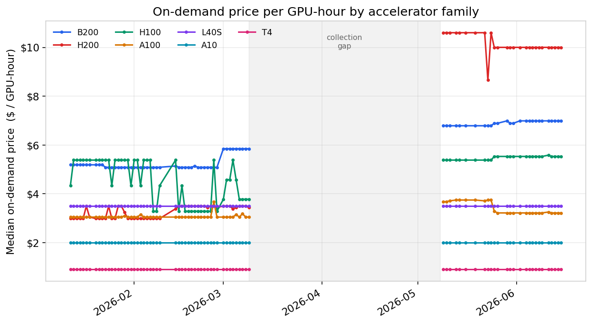

# GPU Price Tracker

[](https://github.com/alex-hubbard/gpu_price_tracker/actions/workflows/daily_update.yml)
[](https://huggingface.co/datasets/afhubbard/gpu-prices)
[](https://gpu-price-trends.streamlit.app/)
[](LICENSE)
[](DATA_LICENSE)

An open, continuously updated dataset of **GPU rental prices across 13
cloud providers** — AWS, GCP, Azure, OCI, Lambda Labs, RunPod, Vast.ai,
DataCrunch, Cudo Compute, TensorDock, Vultr, Nebius, and CloudRift.
Snapshots are collected twice daily (09:00 / 21:00 UTC) since January
2026: **1.7M+ GPU listing observations covering 73 GPU types**, from
H100/H200 clusters to consumer RTX cards, published as Hive-partitioned
Parquet.

**Explore it live: <https://gpu-price-trends.streamlit.app/>**



## Get the data

The easiest way is the [Hugging Face dataset](https://huggingface.co/datasets/afhubbard/gpu-prices):

```python
from datasets import load_dataset

ds = load_dataset("afhubbard/gpu-prices", split="train")
```

Or query it in place with DuckDB — no download of the full dataset needed:

```python
import duckdb

con = duckdb.connect()
con.sql("INSTALL httpfs; LOAD httpfs;")
con.sql("""
    SELECT gpu_type,
           ROUND(AVG(price_per_hour / gpu_count), 3) AS usd_per_gpu_hour,
           COUNT(*) AS listings
    FROM read_parquet('hf://datasets/afhubbard/gpu-prices/prices/**/*.parquet',
                      hive_partitioning = true)
    WHERE dt = (SELECT MAX(dt) FROM read_parquet(
                    'hf://datasets/afhubbard/gpu-prices/prices/**/*.parquet',
                    hive_partitioning = true))
      AND quality = 'ok'
    GROUP BY gpu_type
    ORDER BY usd_per_gpu_hour
""").show()
```

The same files are mirrored on S3 for anonymous access:
`s3://hubbard-gpu-price-data/prices/` (Hive-partitioned by `dt=YYYY-MM-DD`,
one immutable file per snapshot).

Each row is one listing — a `(provider, instance_type, region, is_spot)`
offer observed at a snapshot timestamp — with normalized GPU family,
GPU count, VRAM, vCPUs, RAM, USD price per hour, a row-`quality` tag,
and canonicalized region fields for cross-cloud comparison. Compute
`price_per_hour / gpu_count` for fair cross-SKU comparison, and filter
to `quality = 'ok'` for most analyses. Full schema and caveats:
[methodology.md](methodology.md).

## What's in the box

```
gpuhunt scrapers (13 providers)
        │  collect.py — twice daily via GitHub Actions
        ▼
SQLite (local working store)
        │  scripts/emit_latest_parquet.py — one immutable file per snapshot
        ▼
Parquet: prices/dt=YYYY-MM-DD/snapshot_*.parquet
        ├──► S3 (anonymous read)        ──► Streamlit dashboard (DuckDB httpfs)
        └──► Hugging Face Datasets mirror
```

| | |
| --- | --- |
| [Live dashboard](https://gpu-price-trends.streamlit.app/) | Latest prices, trends, spot spreads, regional dispersion, market deck |
| [methodology.md](methodology.md) | Canonical reference: collection, schema, normalization, spot semantics, limitations |
| [MODELING_GPU_USAGE_TRENDS.md](MODELING_GPU_USAGE_TRENDS.md) | What analytical questions the data can and cannot answer, with starter SQL |
| [dataset_card.md](dataset_card.md) | The Hugging Face dataset card |
| [deck/](deck/README.md) | A 15-slide market analysis built from the dataset (reproducible) |
| [streamlit_app/](streamlit_app/README.md) | Dashboard architecture, S3/HF publishing, deployment |
| [GUIDE.md](GUIDE.md) | Running the collection pipeline yourself |

## Run the collector yourself

```bash
pip install -r requirements.txt

./gpu collect            # one collection pass -> SQLite
./gpu report             # summary report
./gpu best-deals H100    # best current $/GPU-hr for a GPU family
./gpu plot               # price/availability charts
./gpu daily-update       # collect + reports + plots
./gpu setup              # install the twice-daily local scheduler
```

Collection is resilient to single-provider failures, and rows are
tagged at the source (`ok` / `unknown_gpu` / `missing_memory`; CPU-only
SKUs are dropped). To publish your own Parquet tree from the SQLite
store:

```bash
python3 scripts/sqlite_to_parquet.py --db data/gpu_prices.db --out data/parquet
```

The GitHub Actions workflow
([daily_update.yml](.github/workflows/daily_update.yml)) runs the same
pipeline in CI and syncs new snapshots to S3 and Hugging Face.

## License & citation

Code is [MIT](LICENSE); the dataset is
[CC BY 4.0](DATA_LICENSE). If you use the dataset in research, please
cite it ([CITATION.cff](CITATION.cff)):

```bibtex
@misc{hubbard2026gpuprices,
  author       = {Alex Hubbard},
  title        = {GPU Price Tracker},
  year         = {2026},
  howpublished = {\url{https://github.com/alex-hubbard/gpu_price_tracker}},
  note         = {Dataset and software, MIT (code) / CC BY 4.0 (data)}
}
```
